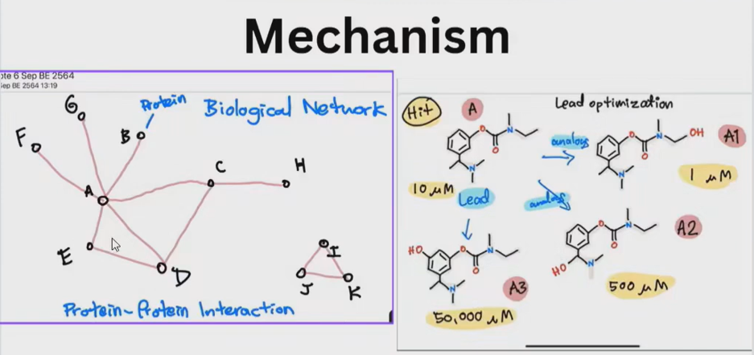
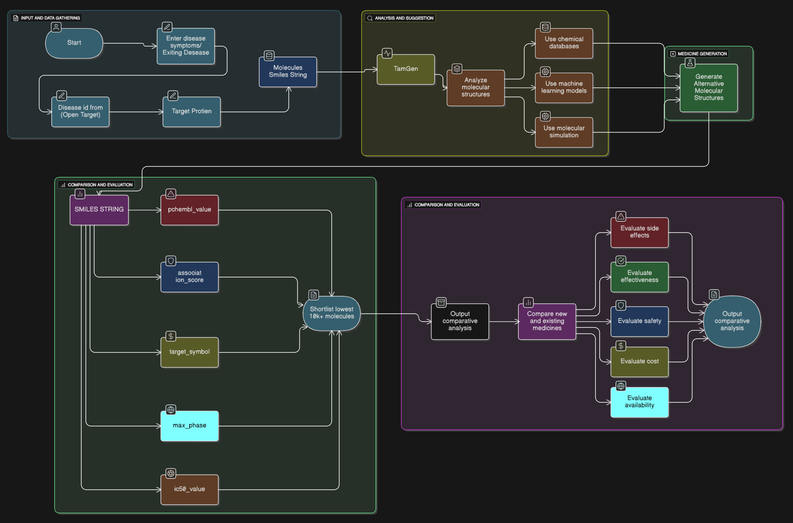

# Pindora_shield

## Problem Statement

Drug discovery is a highly time-consuming and resource-intensive process. 
Existing computational tools for molecular generation and optimization often suffer from limited diversity, slow exploration, and poor usability for researchers. Despite recent advances in AI-driven molecular generation, there remains a gap between research models and practical, researcher-friendly systems capable of rapidly proposing novel, chemically valid drug candidates.

# Live Project : 
[stat-vision.xyz](https://stat-vision.xyz/)
# Demo Video
Check out idea overview video!

## Detailed Description

- Traditional drug discovery pipelines require years of experimentation and extensive trial-and-error, leading to high costs and delayed treatments.
([-DrugPaatentWatch](https://www.drugpatentwatch.com/blog/the-predictive-pipeline-structuring-drug-development-timelines-with-ai-driven-patent-intelligence))

- Existing AI-based molecular generators such as VAE and early GAN models often struggle with mode collapse, limited novelty, or unstable training.
([-Royal Society of Chemistry](https://pubs.rsc.org/en/content/articlehtml/2025/dd/d5dd00170f))

- Many recent transformer-based approaches demonstrate promising results in academic settings but lack validation, reproducibility, or integration into usable research workflows.
([arxiv.org](https://arxiv.org/html/2503.12796v1))

- Researchers struggle to generate diverse, optimized, chemically valid molecules quickly, as models often produce invalid structures, fail synthesizability checks, or overlook multi-property optimization in practical drug pipelines.
([ICLR Conference -openreview.org](https://openreview.net/forum?id=f43lpq1Q8i))

#**Disease–Protein Interaction Network** : Diseases are driven by complex biological networks, not isolated proteins.
- A single disease can involve multiple protein–protein interactions, feedback loops, and pathways.
- Targeting one protein can influence several downstream biological effects.
- Motivation: Our system starts by identifying relevant target proteins associated with the disease before molecule generation

**This justifies why target identification is a critical first step in our workflow.**
 
** Lead Optimization via Molecular Variants **
- In real-world drug discovery, a single lead molecule is rarely optimal.
- Chemists generate multiple structural analogs of a lead compound.
- Each analog can show drastically different potency (µM → nM).
- Motivation: Instead of manually creating analogs, our system automatically

**This motivates our TangGen-based alternative SMILES generation stage**

#** Target Mechanism** : 
- Diseases often arise from enzyme-catalyzed reactions (rate-limiting steps).
- Inhibiting a specific enzyme can block disease progression (e.g., aromatase → estrogen → breast tumor)
- Effective drugs must:
- Bind the target enzyme
- Reduce reaction rateMaintain chemical feasibility
**Motivation**: Generated molecules must be evaluated not just structurally, but pharmacologically.
**This motivates multi-factor evaluation (IC50, association score, phase, target relevance**
## Overview :
The proposed system operates in four major stages:

1 -> Disease & Target Identification
2 -> Molecular Retrieval & Analysis
3 -> De Novo Molecule Generation
4 -> Comparative Evaluation & Optimization

Each stage is designed to reduce manual intervention while ensuring chemical validity, diversity, and optimization across multiple drug-relevant properties.

## **Work FLow **
Pindora Shield follows a structured pipeline where disease-specific molecular candidates are generated and evaluated across multiple drug-relevant dimensions.

Step 1: Disease Context & Target Identification
The system accepts disease-related inputs and identifies relevant target proteins using curated biomedical knowledge sources.
This establishes biological relevance before molecular analysis begins.

Step 2: Molecular Processing (SMILES Representation)
Known molecules linked to identified targets are retrieved and represented using standardized SMILES strings, providing a consistent molecular format for downstream analysis.

Step 3: De Novo Molecule Generation (TangGen)

Based on the disease and target context, a generative model (TangGen) is used to generate alternative candidate molecules.
- Generates diverse and novel SMILES strings
- Ensures chemical validity and structural diversity
- Explores chemical space beyond known drugs

This step produces a large pool of candidate molecular SMILES.

Step 4: Multi-Model Molecular Evaluation
Each generated SMILES is evaluated individually using five specialized, trained models:
- IC50 prediction (potency)
- Target association score
- Clinical phase likelihood
- Target relevance (exploratory)
Rather than using a single multi-task model, each property is predicted by an independent, optimized model, improving accuracy and interpretability.
   - In effect, every SMILES generated by TangGen is passed one-by-one through all five models, producing a comprehensive property profile.

Step 5: Filtering & Shortlisting
Predicted outputs are combined to filter low-potential candidates and shortlist molecules based on pharmacological relevance and feasibility.

Step 6: Comparative Analysis & Ranking
Shortlisted candidates are compared with existing medicines, and a ranked comparative analysis is produced to support research-level decision making.

## Failure Handling & System Reliability

Pindora Shield is designed with defensive failure-handling mechanisms to prevent system crashes and ensure graceful recovery during runtime issues.

- **Isolated Component Execution:**  
  Generative models, predictive evaluators, backend APIs, and frontend rendering operate as independent modules. A failure in one component does not cascade across the entire system.

- **Graceful API Degradation:**  
  Backend endpoints validate inputs and handle unexpected responses (e.g., invalid JSON, empty outputs) without crashing the service. Errors are returned as structured responses instead of unhandled exceptions.

- **Model-Level Fault Tolerance:**  
  Each predictive model runs independently. If a single model fails or times out, the system continues evaluating other properties and flags partial results instead of terminating execution.

- **Frontend Error Guarding:**  
  The frontend includes runtime checks for non-JSON or malformed backend responses and displays informative status messages instead of breaking the UI.

- **Stateless Backend Design:**  
  APIs remain stateless, enabling safe retries, redeployment, or migration without data corruption or recovery complexity.

Together, these mechanisms ensure robustness, prevent full-system crashes, and allow controlled recovery during partial failures or infrastructure instability.

**Dataset & Inputs**
- Public biomedical datasets (e.g., ChEMBL, Open Targets) used for disease–target and drug information
- Molecular data represented using SMILES strings with curated physicochemical descriptors
- Dataset cleaned, deduplicated, and structured for training multiple predictive models
These enhancements will strengthen performance and enable scalable, system-level deployment.

## Team Contributions

The development of **Pindora Shield** was a collaborative effort, with responsibilities distributed across model development, backend engineering, frontend implementation, and system integration.

### Kashif
- Led the development of the **TenGAN / TangGen molecular generation model**.
- Worked on generative modeling, training, and validation of molecule generation pipelines.
- Contributed to backend logic related to molecule generation and model execution.

### Jagdish
- Worked on **machine learning evaluation models**, including individual predictive models for molecular properties.
- Assisted in backend integration for ML inference and result aggregation.
- Contributed to frontend logic related to result handling and data flow.

### Yash
- Implemented major parts of the **backend API layer**.
- Developed and integrated the **3D molecule visualization module**, including WebGL-based molecule rendering.
- Assisted with backend–frontend communication and testing.

### Sameer
- Led the development of the **frontend application**, including UI design and user interaction flows.
- Handled frontend–backend integration and API consumption.
- Supported integration, debugging, and cross-component testing across the system.

All team members collaborated where needed to resolve integration issues, debug system-level problems, and ensure smooth end-to-end functionality.

